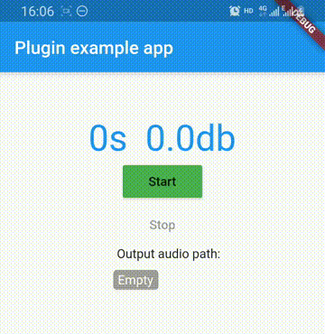

# flutter_audio_recorder

[](https://pub.dartlang.org/packages/chengguo_audio_recorder)

A flutter plugin for audio record.

*Note*: This plugin is still under development, and some APIs might not
be available yet.
[Feedback welcome](https://github.com/FingerArt/flutter_audio_recorder/issues)
and
[Pull Requests](https://github.com/FingerArt/flutter_audio_recorder/pulls)
are most welcome!

## Preview



## Support platform

- [x] Android
- [x] iOS

## Installation

First, add `chengguo_audio_recorder` as a
[dependency in your pubspec.yaml file](https://flutter.io/platform-plugins/).

```yaml
dependencies:
  chengguo_audio_recorder
```

On iOS you need to add a usage description to `info.plist`:

```xml
<key>NSMicrophoneUsageDescription</key>
<string>This sample uses the microphone to record your speech and convert it to text.</string>
<key>UIBackgroundModes</key>
<array>
	<string>audio</string>
</array>
```

## Example

1. Start record

```dart
var path = await AudioRecorder.startRecord();
```

2. Stop record

```dart
await AudioRecorder.stopRecord();
```

3. Determine whether the recording

```dart
var isRecording = await AudioRecorder.isRecording();
```

## Error code

| Error code  | Remark |
|---| --- |
| PERMISSION_DENIED | Request permission is denied. |
| OPTIONS_ERROR | Options error. |
